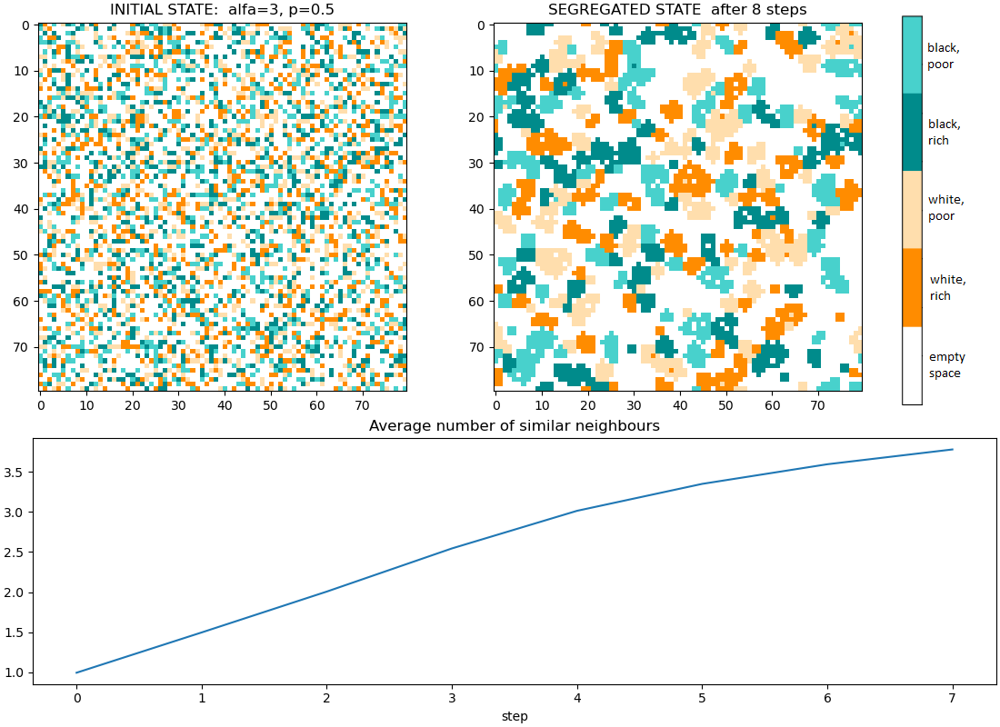

# Spatial Segregation

The aim of the project is implementation of algorithms for spatial segregation considering population characteristics such as race and economic status. The project implement 4 algorithms that perform spatial segregation of the population:

- Schelling algorithm
- Gaylord D-Andria algorithm
- Kullback-Leibler divergence
- Bergman divergence

## Data for Schelling and Gaylord D-Andria algorithms

The data was generated randomly as 4 distinct populations:

- black poor population
- black rich population
- white poor population
- white rich population

An 80x80 matrix with periodic boundary conditions was used as the running space of the algorithm.

## Results

Example image before and after Schelling algorithm with the plot showing the changes in the average number of similar neighbors during the algorithm's run:

Example image before and after Gaylord D-Andria algorithm with the plot showing the changes in the average number of similar neighbors during the algorithm's run:

## How To Run

Agent based modeling segregation:

- `python run_agent_segregation.py`
- `run_simulations.ipynb`

Aglomerative partioning:

- `aglomerative_partioning.ipynb`
